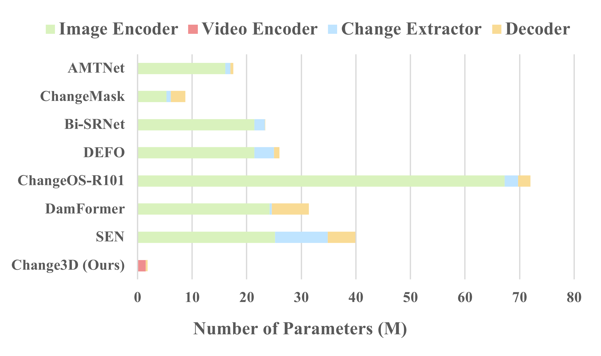
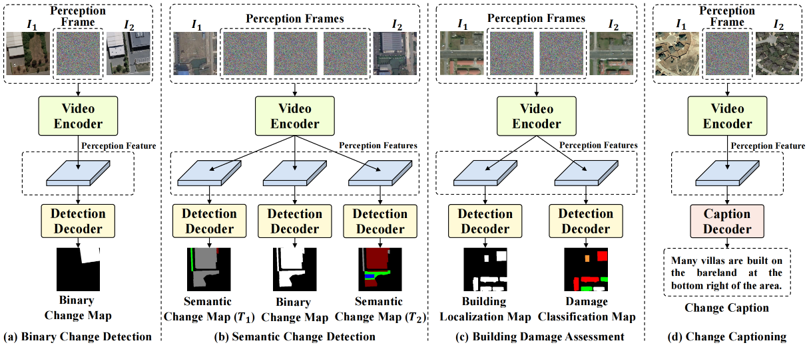
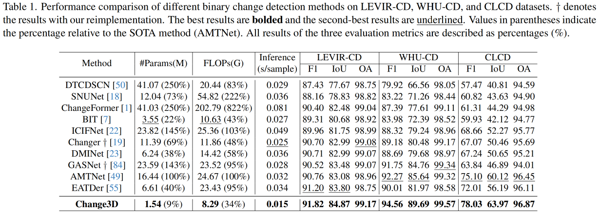
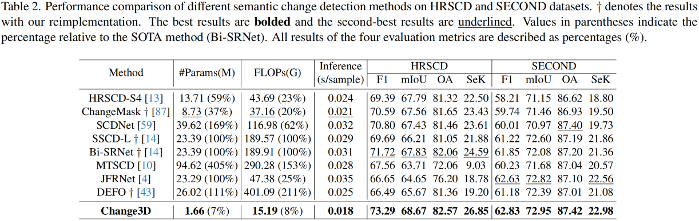
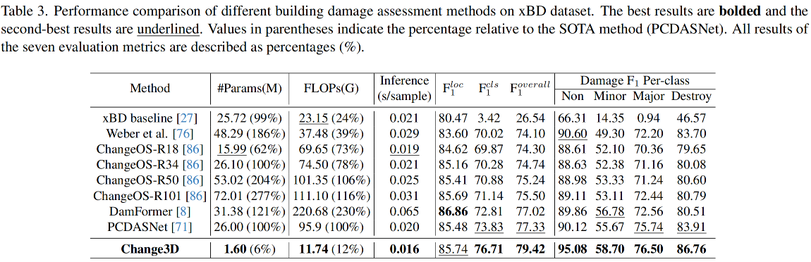
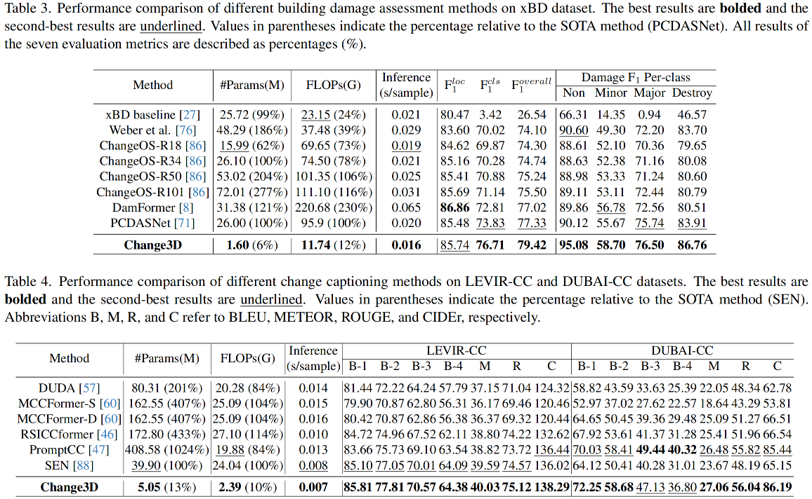

<div align="center">

<h2>Change3D: Revisiting Change Detection and Captioning from A Video Modeling Perspective <be> (CVPR 2025 🔥🔥🔥) </h2>

**_A simple and efficient framework for change detection and captioning tasks._**

[Duowang Zhu](https://scholar.google.com/citations?user=9qk9xhoAAAAJ&hl=en)<sup>1</sup>, [Xiaohu Huang](https://scholar.google.com/citations?user=sBjFwuQAAAAJ&hl=en)<sup>2</sup>, [Haiyan Huang](https://www.researchgate.net/profile/Haiyan-Huang-11)<sup>1</sup>, [Hao Zhou](https://scholar.google.com/citations?user=xZ-0R3cAAAAJ&hl=zh-CN)<sup>3</sup>, and [Zhenfeng Shao](http://www.lmars.whu.edu.cn/prof_web/shaozhenfeng/index.html)<sup>1*</sup>  

<sup>1</sup> Wuhan University&nbsp;&nbsp; <sup>2</sup> The University of Hong Kong&nbsp;&nbsp; <sup>3</sup> Bytedance

<div align="center">

[](https://arxiv.org/pdf/2503.18803)
[](https://arxiv.org/pdf/2503.18803)
[](https://zhuduowang.github.io/Change3D)

</div>

</div>
<div align="center">

</div>

## ✨ Highlights

- **Unified Framework:** Supports multiple change detection and captioning tasks.
- **Highly Efficient: Uses ~6–13% of the parameters and ~8–34% of the FLOPs** compared to SOTA.
- **SOTA Performance:** Achieves SOTA performance **without complex structures**, offering an alternative to 2D models.

## 📰 News

- **[2025.03.25]** We have released all the training codes of Change3D!

- **[2025.02.27]** **Change3D has been accepted by CVPR 2025!** 🎉🎉

## 📄 Abstract

We present **Change3D**, a unified video-based framework for change detection and captioning. Unlike traditional methods that use separate image encoders and multiple change extractors, Change3D treats bi-temporal images as a short video with learnable perception frames. A video encoder enables direct interaction and difference detection, simplifying the architecture. Our approach supports various tasks, including binary change detection (BCD), semantic change detection (SCD), building damage assessment (BDA), and change captioning (CC). Evaluated on eight benchmarks, Change3D outperforms SOTA methods while using only **~6%–13%** of the parameters and **~8%–34%** of the FLOPs.

## 🎮 Framework


Figure 1. Overall architectures of Change3D for Binary Change Detection, Semantic Change Detection, Building Damage Assessment, and Change Captioning.

## 📝 Performance
We conduct extensive experiments on eight public datasets: LEVIR-CD, WHU-CD, CLCD, HRSCD, SECOND, xBD, LEVIR-CC, and DUBAI-CC.









## 🎯 How to Use

### Installation

```
conda create -n Change3D python=3.11.0
conda activate Change3D
pip install torch==2.2.0 torchvision==0.17.0 torchaudio==2.2.0 --index-url https://download.pytorch.org/whl/cu118
pip install -r requirements.txt
```

### Pretrained Weight

Download the [X3D-L](https://dl.fbaipublicfiles.com/pytorchvideo/model_zoo/kinetics/X3D_L.pyth) weight and put it into the root directory.

### Data Preparation

- For BCD: 
Download [LEVIR-CD](https://chenhao.in/LEVIR/), [WHU-CD](http://gpcv.whu.edu.cn/data/building_dataset.html) and [CLCD](https://github.com/liumency/CropLand-CD) datasets. Prepare the dataset into the following structure and crop each image into 256x256 patches.
```
    ├─Train
        ├─t1          jpg/png (input image of T1)
        ├─t2          jpg/png (input image of T2)
        └─label       jpg/png (binary change mask)
    ├─Val
        ├─t1 
        ├─t2
        └─label
    ├─Test
        ├─t1
        ├─t2
        └─label
```

- For SCD:
Download [HRSCD](https://rcdaudt.github.io/hrscd/) and [SECOND](https://captain-whu.github.io/SCD/) datasets. Prepare the dataset into the following structure and crop each image into 256x256 patches.
```
    ├─Train
        ├─t1          jpg/png  (input image of T1)
        ├─t2          jpg/png  (input image of T2)
        ├─label1      jpg/png  (semantic mask of T1)
        ├─label2      jpg/png  (semantic mask of T2)
        └─change      jpg/png  (binary change mask)
    ...

    ├─Test
        ├─t1
        ├─t2
        ├─label1
        ├─label2
        └─change
```

- For BDA:
Download [xBD](https://xview2.org/dataset) dataset. Prepare the dataset into the following structure and crop each image into 256x256 patches.
```
    ├─Train
        ├─t1          jpg/png  (input image of T1)
        ├─t2          jpg/png  (input image of T2)
        ├─label1      jpg/png  (damage localization mask)
        └─label2      jpg/png  (damage level mask)
    ...

    ├─Test
        ├─t1
        ├─t2
        ├─label1
        └─label2
```

- For CC:
Download [LEVIR-CC](https://github.com/Chen-Yang-Liu/RSICC) and [DUBAI-CC](https://disi.unitn.it/~melgani/datasets.html) datasets. Then follow the practice introduced in [RSICCformer](https://github.com/Chen-Yang-Liu/RSICC/blob/main/create_input_files.py).

## 🎮 Train & Evalaute the Models

Training binary change detection with LEVIR-CD dataset as an example:

```
python ./scripts/train_BCD.py --dataset LEVIR-CD
                              --file_root path/to/LEVIR-CD
                              --pretrained path/to/X3D_L.pyth
                              --save_dir ./exp
                              --gpu_id 0
```

**Note:** The above train script completes the evaluation automatically.

## ❤️ Acknowledgements

This repository is mainly built upon [pytorchvideo](https://github.com/facebookresearch/pytorchvideo) and [RSICCformer](https://github.com/Chen-Yang-Liu/RSICC). Thanks for those well-organized codebases.

## 📧 Contact

If you have any issues while using the project, please feel free to contact me: [zhuduowang@whu.edu.cn](zhuduowang@whu.edu.cn).

## 📜 License

Change3D is released under the [`CC BY-NC-SA 4.0 license`](https://creativecommons.org/licenses/by-nc-sa/4.0/).

## 📚 Citation

If you find our work useful, please consider citing our paper:

```
@article{zhu2025change3d,
  title={Change3D: Revisiting Change Detection and Captioning from A Video Modeling Perspective},
  author={Zhu, Duowang and Huang, Xiaohu and Huang, Haiyan and Zhou, Hao and Shao, Zhenfeng},
  journal={arXiv preprint arXiv:2503.18803},
  year={2025}
}
```
